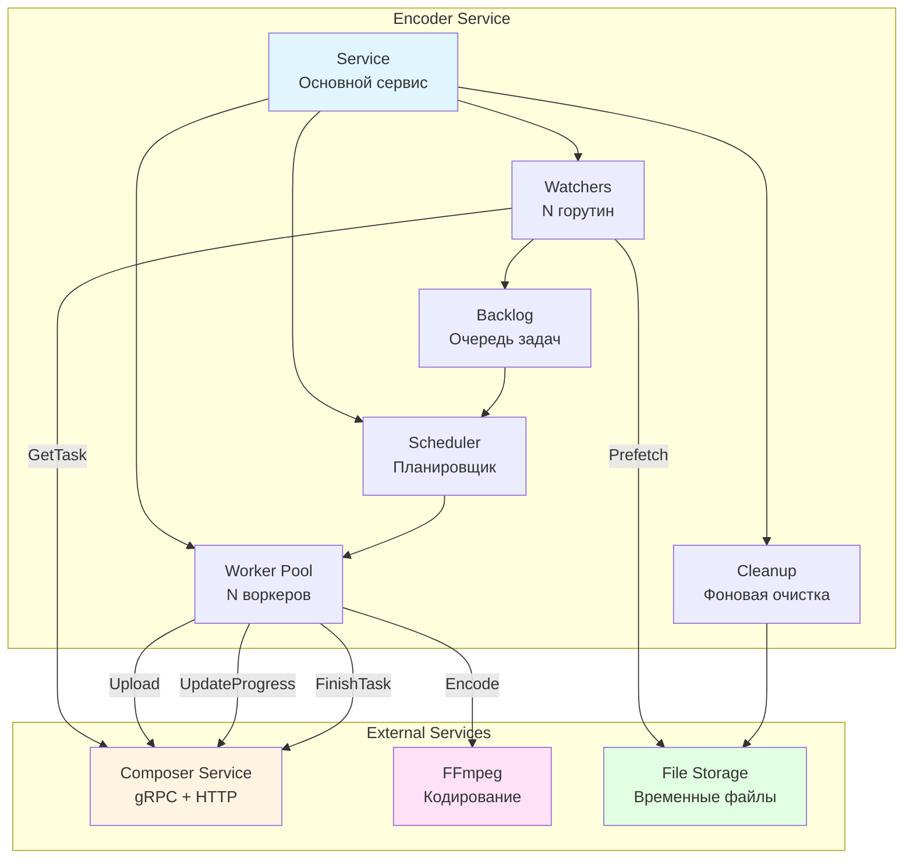
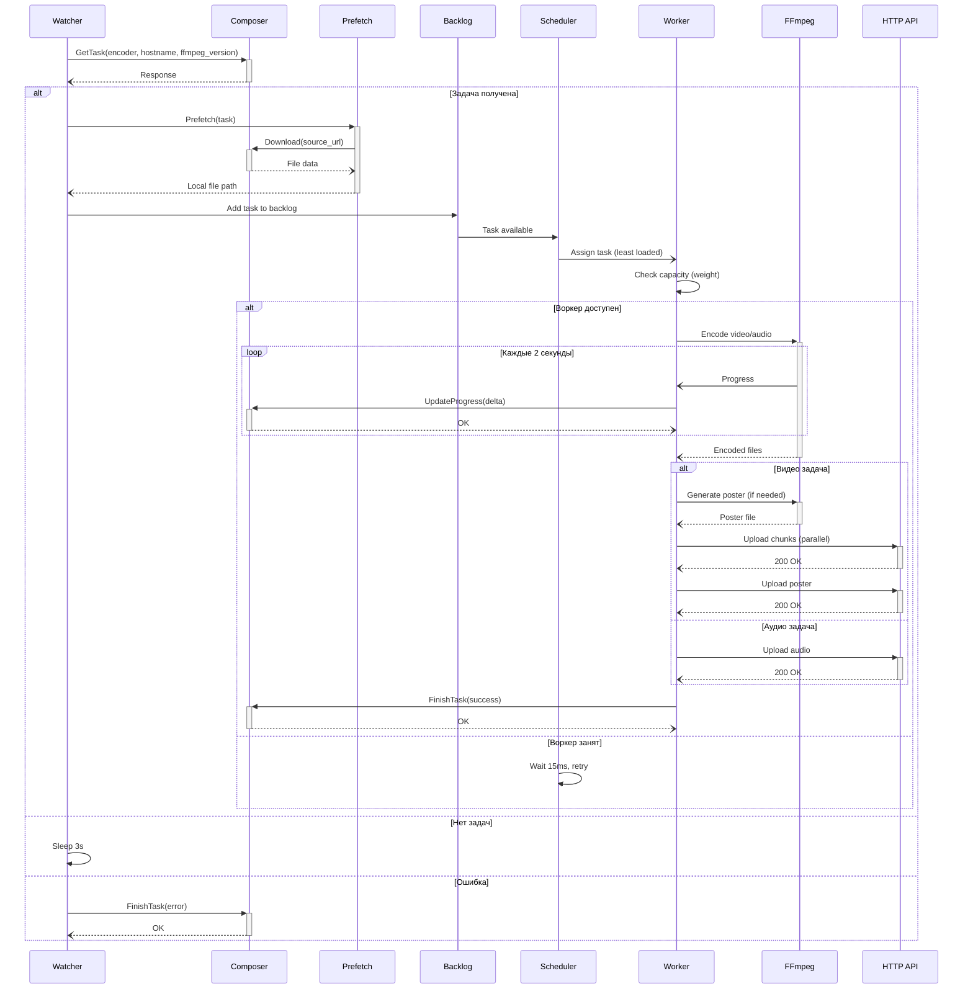
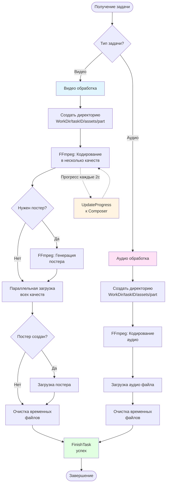
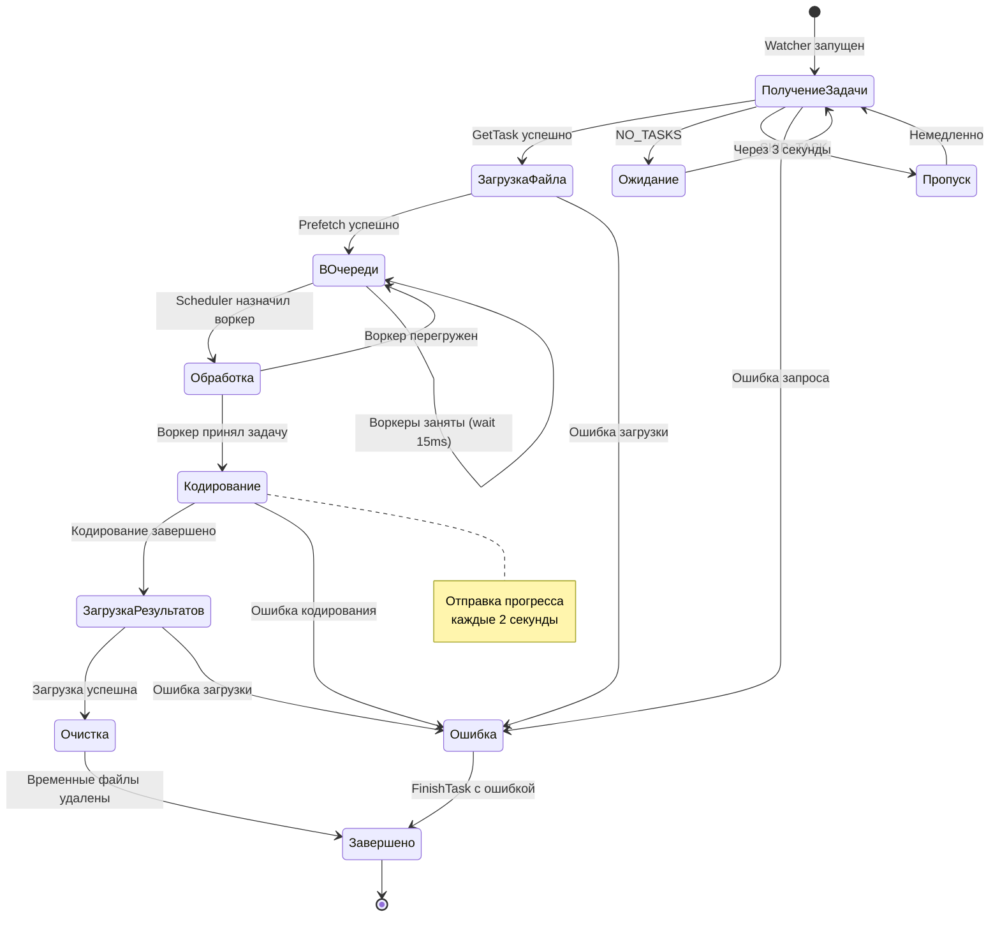
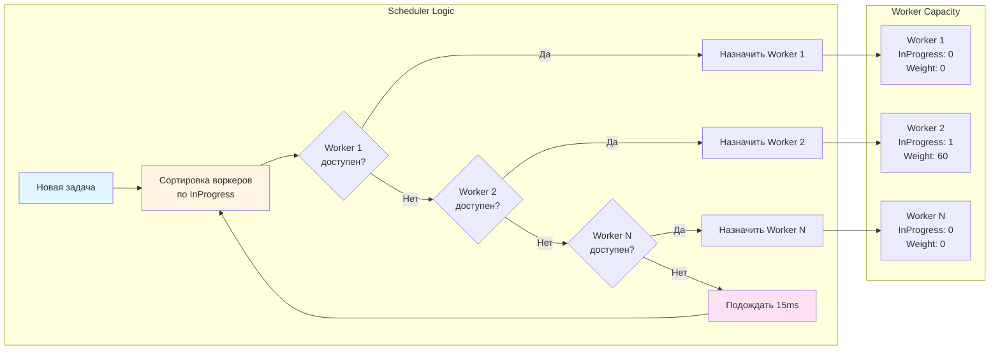
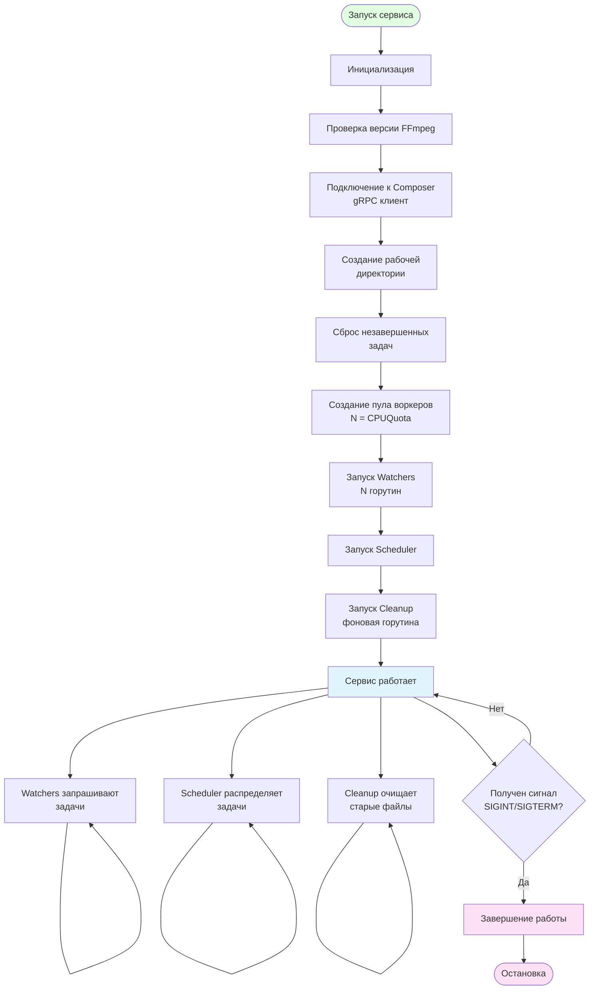
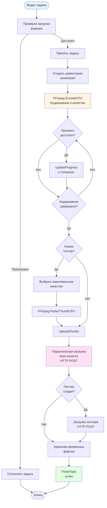
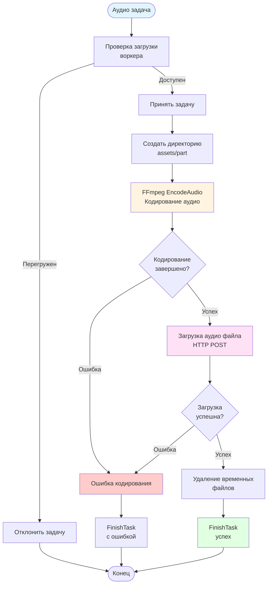

## 1. Архитектура Encoder сервиса

## 2. Диаграмма последовательности обработки задачи

## 3. Блок-схема алгоритма работы воркера

## 4. Диаграмма состояний задачи в Encoder

## 5. Диаграмма распределения нагрузки

## 6. Диаграмма жизненного цикла Encoder сервиса

## 7. Диаграмма обработки видео задачи

## 8. Диаграмма обработки аудио задачи

